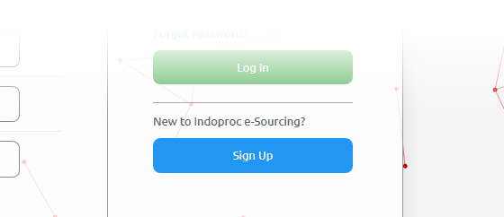

Login & Register
================

.. _login_instructions:

Login
-----

Jika Anda sudah memiliki akun, Anda dapat masuk ke aplikasi web dari Laman Masuk <http://indoproc.com/esourcing/sign/login> `_:

- masukan email dan kata sandi anda yang terdaftar

	.. image:: img_src/login.png
    :width: 550px
    :alt: Login Section

- klik tombol 'login'
  
Register
--------

If you don't have an account, you can create a new one from this `link <http://indoproc.com/esourcing/register>`_ or click 'Sign Up' button from the login page.

For start your registration, please follow these instructions below:

- Input all the required data

  .. image:: img_src/register_1.png
    :width: 550px
    :alt: Sign Up Button

  .. image:: img_src/register_2.png
    :width: 550px
    :alt: Sign Up Button

  .. image:: img_src/register_3.png
    :width: 550px
    :alt: Sign Up Button

- Choose Your Role:

  .. image:: img_src/role_ss.png
    :width: 550px
    :alt: role select
 
 - Check 'Client': if your company want to create the RFQ and get the quotation from supplier
 - Check 'Supplier': If your company want to submit quotation in response to published RFQ that created by 'client' Companies
 - You can also check both of 'Client' and 'Supplier'
 
- click 'Sign Up' button and the 'activation' link will be sent to your email

Activate your account:

  - Check your email inbox; if you couldn't find the email, please check your spam/junk folder
  - Click 'Activate account' button and you'll be redirected to welcome page
  
    .. image:: img_src/active_ss.png
        :width: 550px
        :alt: Activation Email
  
  - To start login you can follow the :ref:`Login Instructions <login_instructions>` above.
