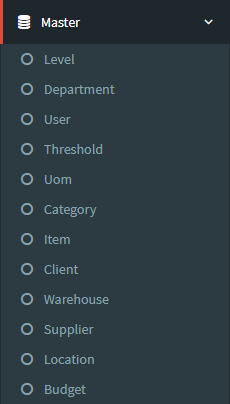
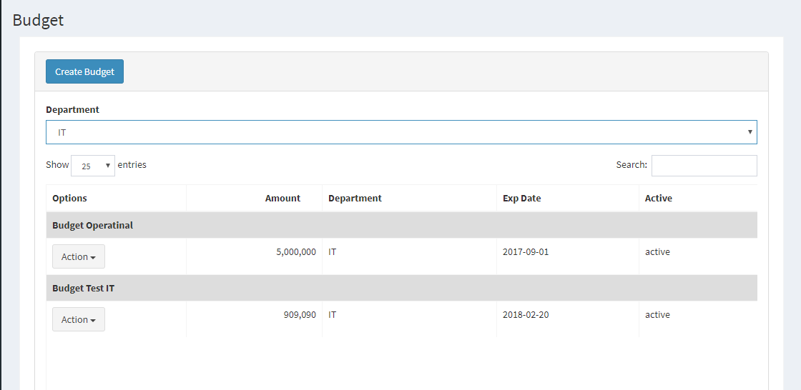

.. _supplier_list:

budget List
=============

Anda dapat menambahkan daftar budget Anda sendiri ke situs web. Untuk menambahkan atau melihat daftar budget, Anda bisa mengklik menu 'Master' dan pilih 'budget'.

- Ada daftar budget yang akan ditampilkan di halaman ini. Ini akan menunjukkan options, nama budget, active dari budget tersebut.
- Anda juga bisa menyortir budget dengan nama budget atau active menurut abjad.

Create New budget
-------------------

 .. image:: ../img_src/budget_add_button.png
     :width: 200px
     :alt: Login Section

 - Klik tombol "Create budget" di kiri atas halaman ini.
 
 .. image:: ../img_src/budget_add.png
    :width: 400px
    :alt: Login Section
 
 - Muncul Form Create dan Anda bisa memasukkan Nama budget dan Active.
 - Kemudian klik tombol "Save" untuk menyimpan data budget. 
 
Edit/Update budget
--------------------
  .. image:: ../img_src/budget_option.png
    :width: 150px
    :alt: Login Section

 - Anda bisa klik tombol "Edit" pada baris yang ingin Anda edit.

 .. image:: ../img_src/budget_edit.png
    :width: 600px
    :alt: Login Section
 
 - Form Edit akan dibuka dan Anda bisa mengubah data budget di sana.
 - Kemudian klik tombol "Save" untuk menyimpan data budget.