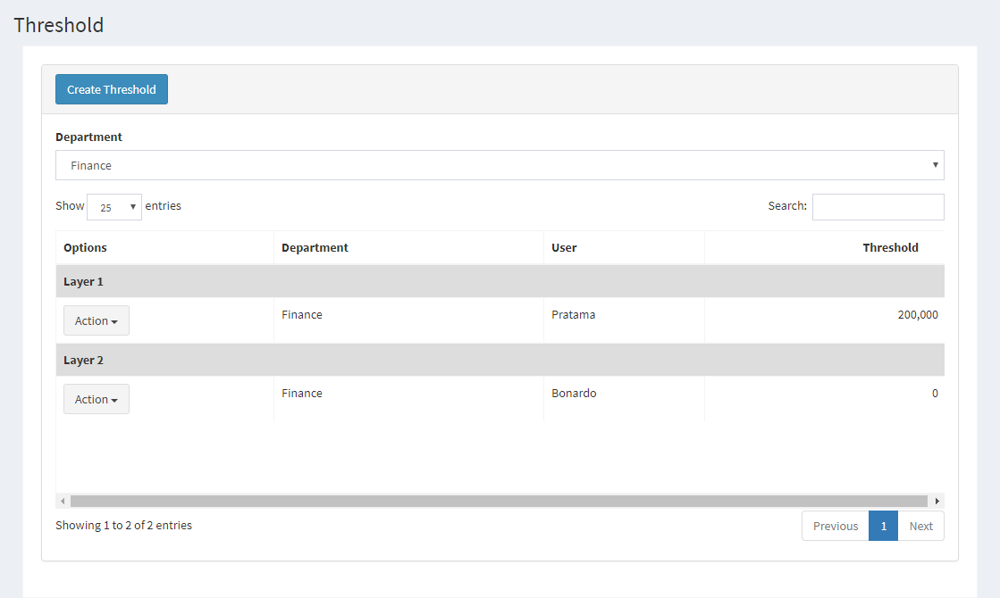

.. _supplier_list:

Threshold List
=============

Anda dapat menambahkan daftar threshold Anda sendiri ke situs web. Untuk menambahkan atau melihat daftar threshold, Anda bisa mengklik menu 'Master' dan pilih 'Threshold'.

.. image:: ../img_src/dashboard_master.png
    :width: 180px
    :alt: Login Section

- Ada daftar threshold yang akan ditampilkan di halaman ini. Ini akan menunjukkan options, nama threshold, active dari threshold tersebut.
- Anda juga bisa menyortir threshold dengan nama threshold atau active menurut abjad.

Create New Threshold
-------------------

 .. image:: ../img_src/threshold_add_button.png
     :width: 200px
     :alt: Login Section

 - Klik tombol "Create Threshold" di kiri atas halaman ini.
 
 .. image:: ../img_src/threshold_add.png
    :width: 400px
    :alt: Login Section
 
 - Muncul Form Add dan Anda bisa memasukkan Layer, Threshold, User dan Department.
 - Kemudian klik tombol "Save" untuk menyimpan data threshold. 
 
Edit/Update Threshold
--------------------
  .. image:: ../img_src/department_option.png
    :width: 150px
    :alt: Login Section

 - Anda bisa klik tombol "Edit" pada baris yang ingin Anda edit.

 .. image:: ../img_src/threshold_edit.png
    :width: 600px
    :alt: Login Section
 
 - Form Edit akan dibuka dan Anda bisa mengubah data threshold di sana.
 - Kemudian klik tombol "Save" untuk menyimpan data threshold.