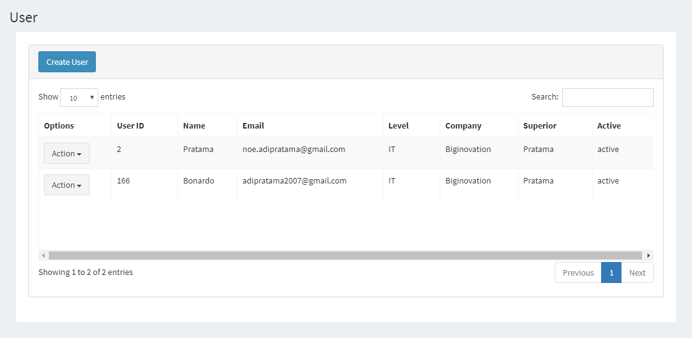

.. _supplier_list:

User List
=============

Anda dapat menambahkan daftar department Anda sendiri ke situs web. Untuk menambahkan atau melihat daftar department, Anda bisa mengklik menu 'Master' dan pilih 'Department'.

.. image:: ../img_src/dashboard_master.png
    :width: 180px
    :alt: Login Section

- Ada daftar department yang akan ditampilkan di halaman ini. Ini akan menunjukkan options, nama department, active dari department tersebut.
- Anda juga bisa menyortir department dengan nama department atau active menurut abjad.

Create New User
-------------------

 .. image:: ../img_src/department_add_button.png
     :width: 200px
     :alt: Login Section

 - Klik tombol "Add Department" di kiri atas halaman ini.
 
 .. image:: ../img_src/user_add.png
    :width: 400px
    :alt: Login Section
 
 - Muncul Form Add dan Anda bisa memasukkan Nama Department dan Active.
 - Kemudian klik tombol "Save" untuk menyimpan data department. 
 
Edit/Update Department
--------------------
  .. image:: ../img_src/department_option.png
    :width: 150px
    :alt: Login Section

 - Anda bisa klik tombol "Edit" pada baris yang ingin Anda edit.

 .. image:: ../img_src/department_edit.png
    :width: 600px
    :alt: Login Section
 
 - Form Edit akan dibuka dan Anda bisa mengubah data department di sana.
 - Kemudian klik tombol "Save" untuk menyimpan data department.