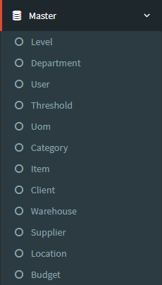

.. _supplier_list:

Warehouse List
=============

Anda dapat menambahkan daftar warehouse Anda sendiri ke situs web. Untuk menambahkan atau melihat daftar warehouse, Anda bisa mengklik menu 'Master' dan pilih 'warehouse'.

- Ada daftar warehouse yang akan ditampilkan di halaman ini. Ini akan menunjukkan options, nama warehouse, active dari warehouse tersebut.
- Anda juga bisa menyortir warehouse dengan nama warehouse atau active menurut abjad.

Create New Warehouse
-------------------

 .. image:: ../img_src/warehouse_add_button.png
     :width: 200px
     :alt: Login Section

 - Klik tombol "Add warehouse" di kiri atas halaman ini.
 
 .. image:: ../img_src/warehouse_add.png
    :width: 400px
    :alt: Login Section
 
 - Muncul Form Add dan Anda bisa memasukkan Nama warehouse dan Active.
 - Kemudian klik tombol "Save" untuk menyimpan data warehouse. 
 
Role Warehouse
--------------------
  .. image:: ../img_src/warehouse_option.png
    :width: 150px
    :alt: Login Section

 - Anda bisa klik tombol "Role" pada baris yang ingin Anda edit.

 .. image:: ../img_src/warehouse_role.png
    :width: 600px
    :alt: Login Section
 
 -  Ada daftar role yang akan ditampilkan di halaman ini. Ini akan menunjukkan options, user, warehouse, status dari warehouse tersebut.
 
 .. image:: ../img_src/warehouse_role_add.png
     :width: 200px
     :alt: Login Section
 
 - Anda bisa klik tombol "Create Role Warehouse" untuk menambahkan role pada warehouse.
 
  .. image:: ../img_src/warehouse_role_form.png
     :width: 200px 
     :alt: Login Section 

 - Muncul Form Create dan Anda bisa memilih Nama warehouse, username dan Active.
 - Kemudian klik tombol "Save" untuk menyimpan data role warehouse. 
 
 .. image:: ../img_src/warehouse_role_option.png
    :width: 150px
    :alt: Login Section

 - Anda bisa klik tombol "Edit" pada baris yang ingin Anda edit.
 - Form Edit akan dibuka dan Anda bisa mengubah data warehouse di sana.
 
 .. image:: ../img_src/warehouse_role_edit.png
    :width: 600px
    :alt: Login Section

 - klik tombol "Save" untuk menyimpan data warehouse.
 
Edit/Update Warehouse
--------------------
  .. image:: ../img_src/warehouse_option.png
    :width: 150px
    :alt: Login Section

 - Anda bisa klik tombol "Edit" pada baris yang ingin Anda edit.

 .. image:: ../img_src/warehouse_edit.png
    :width: 600px
    :alt: Login Section
 
 - Form Edit akan dibuka dan Anda bisa mengubah data warehouse di sana.
 - Kemudian klik tombol "Save" untuk menyimpan data warehouse.
 
 
