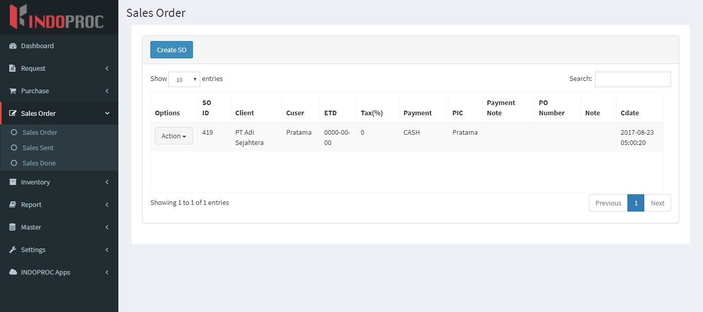

.. _supplier_list:

Sales Order List
=============

Anda dapat menambahkan daftar sales order Anda sendiri ke situs web. Untuk menambahkan atau melihat daftar sales order, Anda bisa mengklik menu 'Sales Order' dan pilih 'Sales Order'.

- Ada daftar sales order yang akan ditampilkan di halaman ini. Ini akan menunjukkan options, SO ID, Client, Cuser, ETD, Tax, Payment, PIC, Payment Note, PO Number, Note, dan Cdate dari sales order tersebut.
- Anda juga bisa menyortir sales order dengan SO ID.

Create New Sales Order
-------------------

 .. image:: ../img_src/so_add_button.png
     :width: 200px
     :alt: Login Section

 - Klik tombol "Create Sales Order" di kiri atas halaman ini.
 
 .. image:: ../img_src/so_add1.png
    :width: 400px
    :alt: Login Section
 
 - Muncul Form Add dan Anda bisa memasukkan data Sales Order.
 - Kemudian klik tombol "Save" untuk menyimpan data sales order. 
 
Edit/Update Sales Order
--------------------
  .. image:: ../img_src/so_option.png
    :width: 200px
    :alt: Login Section

 - Anda bisa klik tombol "Edit" pada baris yang ingin Anda edit.

 .. image:: ../img_src/so_edit.png
    :width: 600px
    :alt: Login Section
 
 - Form Edit akan dibuka dan Anda bisa mengubah data sales order di sana.
 - Kemudian klik tombol "Save" untuk menyimpan data sales order.
 
Sales Order Detail
--------------------
  .. image:: ../img_src/so_option.png
    :width: 200px
    :alt: Login Section

 - Anda bisa klik tombol "Detail" pada baris yang ingin Anda lihat lebih detail.

 .. image:: ../img_src/so_detail.png
    :width: 800px
    :alt: Login Section